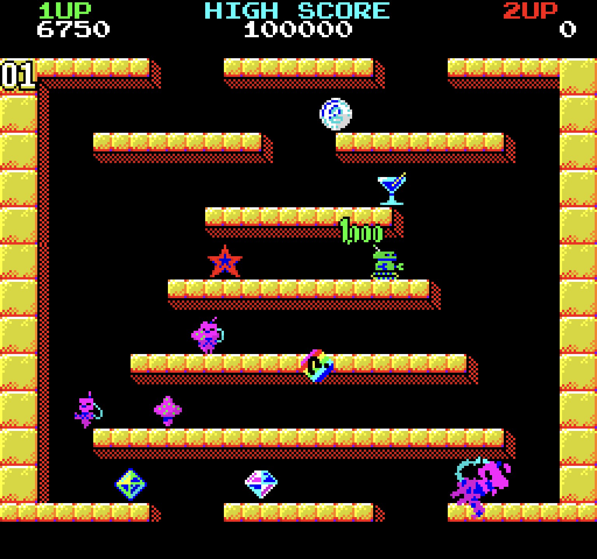

# Beep Boop

_Beep Boop_ is a video game that lifts heavily from the original Bubble Bobble arcade game. It's built using the [overreact.js](overreactjs.github.io) game engine, and it runs on PC, Mac, and Linux, using Electron to bundle it as native apps.



## Install dependencies

```
npm i
```

## Run in browser

Run the vite dev server and process tailwind styles concurrently:

```
# full game
npm run dev:full

# demo
npm run dev:demo
```

Open `http://localhost:5173` in a browser.

## Run in electron

Build and run the game in the electron dev environment.

```
# full game
npm run electron:dev:full

# demo
npm run electron:dev:demo
```

## Production build and package

To build and package the game as native macOS and Windows apps:

```
npm run electron:pack
```
